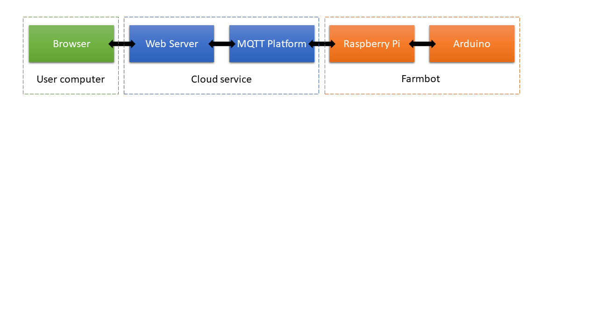
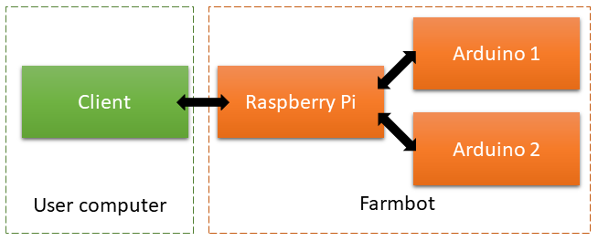
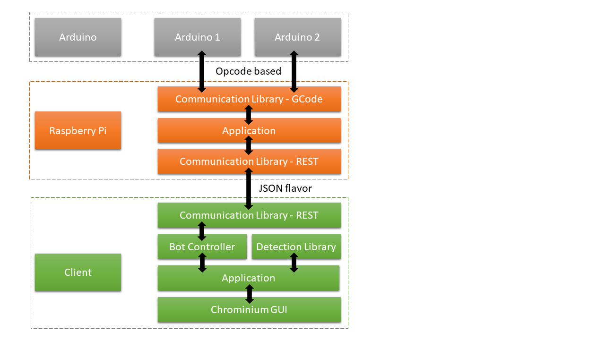

# Weed bot

## Goal and context
This project aims to add a weed detection and elimination feature to the [Farmbot](https://farm.bot/). A similar feature is already present through a "FarmWare" in the Farmbot Web App. We tried to improve upon that work and build a better system with a new detection system and a destruction head based on boiling water. As such, additional code and hardware is required to run the weed detection and elimination feature.

This was a 3 weeks project for [Mecatro](https://sites.google.com/site/mecatromines/) class at [Ecole des Mines de Paris](http://www.mines-paristech.fr/). 

## Software considerations

The former pipeline was built around a web server which let you control your farmbot everywhere around the world. It has great integration with the farmbot software : Each individual pin can be activated or de-activated, a map of your garden is available where plants are shown, it's possible to control plant watering, take photos of your garden. When network connectivity is available, it is a great interface to control the farmbot.

One of the main issue of this pipeline is the latency. It takes several seconds up to a minute to move the farmbot and an even longer time to take a photo. Disconnections also happen frequently.

Installing a [local server](https://github.com/FarmBot/Farmbot-Web-App) which imitates the cloud services of the farmbot has been proved to be a difficult task. After a day of work, we where able to make the Web Server and the MQTT server run, and connect to it on a browser, however the Farmbot could not log into the server.

Finally, it seemed that it was difficult to modify the Farmbot OS running on the raspberry Pi, and the Web server to support the additional hardware and software necessary for the weed elimination. We decided to devise a new improved pipeline addressing the issues we saw while keeping the same "Spirit" as the original Farmbot project. Here are the main points we wanted to address:
- **Latency** : We want to have a real-time feedback from the camera feed and a close to real-time control of the farmbot.
- **Offline mode** : The pipeline should be able to run in an offline environment or an online one.
- **Simplicity** : We want to be able to easily add functionality to our bot. Each component should be modulable, and written in a way that is easy to understand. The application should be multi-platform.
- **Portable** : The final system should be as independant of the Farmbot as possible. The long term vision of the project would be to build a mobile robot gardener.

## Boiler based weed elimination
The elimination method chosen to kill the weed is based on hot water (70-90°C). A switch change the water flux to redirect it to a specific compartment. A coffee machine boiler heat the water to 90°C. As soon as the water in the compartment hit the 70°C mark, it starts getting released to burn the weed. A dedicated arduino controls the water heating process to ensure that it does not go beyond 90°C as a safety measure. It is able to receive message to start/stop boiling the water, an return the temperature inside the compartment.

## New pipeline

The new pipeline removes the external cloud web server and uses a client-server configuration where the user is the client and the raspberry pi host the server. The second arduino which controls the boiler is hooked to the raspberry pi. The raspberry pi simply relays messages between the client and the two arduinos. The client process the pictures and commands the arduinos.

## Code architecture

The code is divided in several modules that are interconnected. 
Each module is inside its own subfolder in this GIT repository. 
* [lib-detection](lib-detection/) contains the detection library module used to analyse the camera feed and detect the weed.
* [client](client/) is the client application which controls the farmbot and send command to the raspberry.
* [raspberry-server](raspberry-server/) : The Raspberry server runs on the raspberry and dispatch the messages between the raspberry and the arduinos.
* [arduino-temp-control](arduino-temp-control/) : This is the code for the arduino controling the temperature.
* [ext/farmbot-arduino-firmware-master](ext/farmbot-arduino-firmware-master/) is a fork of the [farmbot arduino firmware](https://github.com/FarmBot/farmbot-arduino-firmware) available on github.
* [ext/farmware_tools](ext/farmware_tools/) is a fork of the [farmware_tools package](https://github.com/FarmBot-Labs/farmware-tools) modified to work on windows. 

For details about the inner working of each module, see its README.md file.

