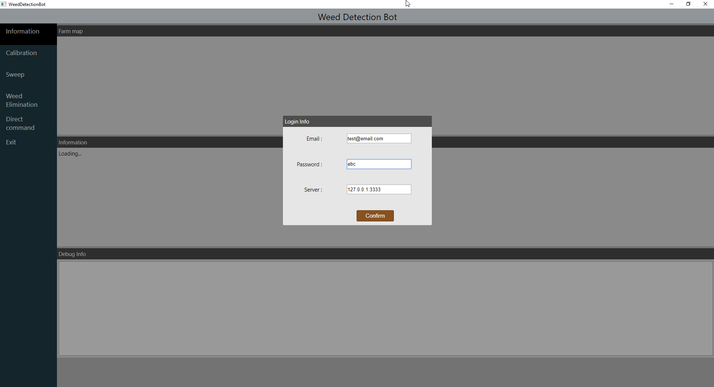
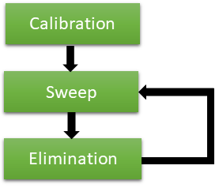
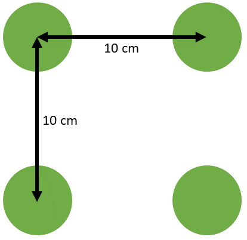
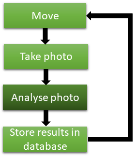
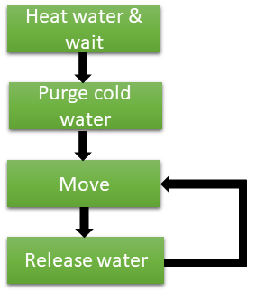

# WeedBotClient

The weed bot client controls the farmbot. 

The user interface uses a chrominium application through cefpython3. 

It focuses around 3 core functionalities :
- **Calibration** of the camera
- **Sweep and recognition** of the garden
- **Weed Elimination**

## Login

The first page is the login page of the application. it is necessary to retrieve the token used to identify the user.
It also selects the server to contact. See raspberry-server for informations about this process.

## Calibration

The calibration require a user interaction and should only be done once. A pattern is put on the ground in front of the camera. It is made of 4 green circles separated by 10cm. This will used to transform coordinates in the camera space to the farmbot space.

## Sweep and recognition

The farmbot head moves around the garden to build a map of the garden. For each picture taken, the weed detection library is called to extract the plants and the weed. Thanks to the callibration step done before, we can geolocalise each object in the farmbot space. The data is inserted into a database. 

A step is requiered to remove duplicates caused by overlapping photos.

## Weed Elimination

The farmbot elimination function use the information built from the previous sweep and recognition step to burn the weed via hot water. It starts by heating water inside a boiler, then the robot move to the coordinates of each weed and release water for 3 seconds. This is enough to burn the plant as the water is 70°C or more.