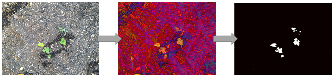
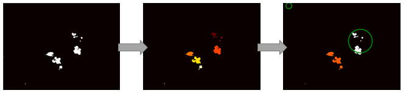

# Weed Detection library

The weed detection library uses OpenCV to detect plants and weed from the camera-feed. It takes as an input a specific image to be processed and information about the plants being processed.

It outputs two list of markers. The first one is the list of marker attributed to plants and the second one is the list of markers attributed to weeds. 

The plant markers can be used to build a plant database and update the plant informations while the weed markers are used for weed elimination.

## Processing pipeline




The first step is a transformation to the HSV color space. Then we filter the green color that is characteristic of leafs to build a mask. An opening and a closing step are required to remove irregularities such as small inconsistencies in the mask (gap), or miss detected pixels.




Then, a segmentation algorithm runs on the mask. It tries to group together leaf that come from probably the same plant. This is done through the connected component function of OpenCV.

Finally an analysis step discriminates between plants and weeds depending on the plant location given. 

## Input and outputs

The input are an image, and a plant information dictionary : Example from converting 'data/test-1/input/database.csv' to a dictionary.
``` Python
[
    { # First plant
        'index':0,   # Plant index
        'posX':1300, # Image X coordinates
        'posY':2600, # Image Y coordinates
        'radius':400 # Plant radius in image coordinates
    },    
    { # Second plant
        'index':1,
        'posX':100,
        'posY':200,
        'radius':100
    }
]
```

The output is a tuple of [skimage.regionprops](http://scikit-image.org/docs/dev/api/skimage.measure.html#regionprops) arrays that can be further processed. The first one is associated to the plants, the second one to the weeds.