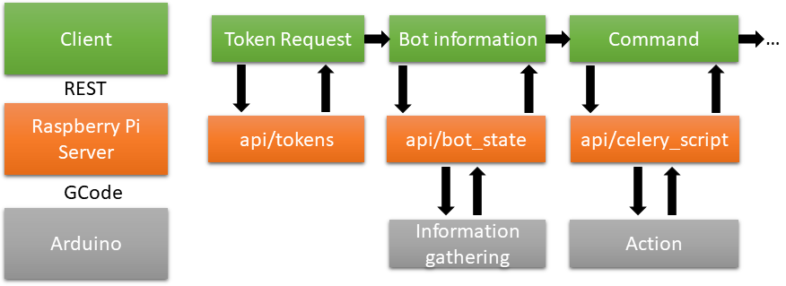

# Raspberry-server

The raspberry server is hosted directly on the raspberry. It is a relay between the arduinos and the client. it is also able to take photos.

We kept the same interface as the Farmbot Web App api.

The core functionalities of the pipeline are :
- Requesting a token
- Obtaining information about the bot (Pis status, motor position, location)
- Sending command to the bot



## Getting token

Each command is validated through a token. The first step is always to obtain this token from a couple of email address and password.

The following entrypoint is used : `http://ip:port/api/tokens`. You should send a post request with the email and the password in the body of the message :
```
{
    'email':'email@email.com',
    'password':'password'
}
```

If the credentials are valid, a HTTP 200 code will be emited with the token in the body.

## Receiving commands and pushing them to the arduinos

### Reception of celery scripts

The `http://ip:port/api/celery_scripts` entrypoint allows for the reception of celery scripts command. It is highly suggested to look at the device class in the [farmware_tools package](https://github.com/FarmBot-Labs/farmware-tools) or the modified version in the client module.

Most of the command are not implemented even if they return a HTTP200 response. The documentation for celery scripts command is available [here](https://developer.farm.bot/v6/docs/celery-script).

The header of each celery script request should contain the aformentioned token in the header 'Authorization' field.


## Command sent to the arduinos

GCode command are sent to the arduinos. A list of GCode commands are available in the official repo of the [farmbot-arduino-firmware repo](https://github.com/FarmBot/farmbot-arduino-firmware). Those commands are complemented with the commands available in the arduino-temp-control module.

Most of the command are implemented on the arduino side but are not accessible in the API.

## Obtaining information about the bot

The `http://ip:port/api/bot_state` entrypoint gives the current state of the bot with it's location and status.

# Information for the user

For the moment the arduinos detection is done by hand in the `com_arduino.py` file. Be careful to select the correct arduino or the software won't work.


